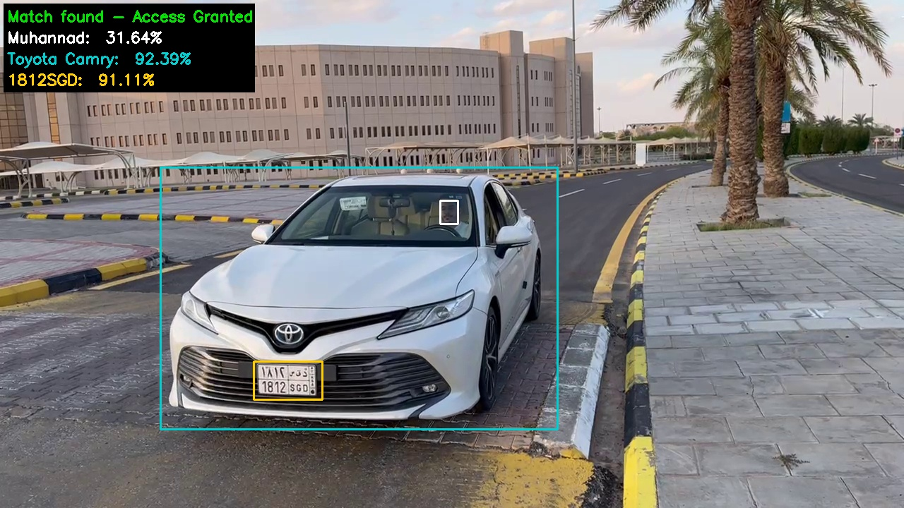

# TRI-GATE: A Tri-Modal Anti-Spoofing System for Gate Access Using Vehicle, License Plate, and Face Recognition

<p align="center">
  
</p>

TRI-GATE is a tri-modal access control pipeline that combines **vehicle recognition**, **license plate recognition**, and **driver face recognition** to make a final **gate access decision in real time**.

---

## Features

- **License Plate Recognition:**
  - Detects and authenticates license plates, including Saudi-specific formats.
 

- **Vehicle Classification:**
  - Identifies vehicle make and model (e.g., Toyota Camry, Honda Accord, Ford Crown Victoria).

- **Facial Recognition:**
  - Authenticates drivers using advanced facial recognition (InsightFace).


- **Real-Time Performance:**
  - Provides fast and reliable detection and authentication.

---

## Model

### Overview:
**Input:** Live video → **(Vehicle + Plate + Face recognition)** → **Score Fusion** → **Gate decision**

### **How TRI-GATE Works (Simple Pipeline):**

1. **Capture live video**
   - A camera records a short live stream as a vehicle approaches the gate.

2. **Detect the vehicle in each frame**
   - The system uses **YOLOv4-tiny** to detect the vehicle bounding box in the scene.

3. **Pick the “best” frame (to reduce latency)**
   - Instead of processing every frame, the system selects **one best frame** using an **IoU-based rule** (the frame where the vehicle is most properly positioned and visible).
   - This reduces compute and speeds up the full pipeline.

4. **Recognize vehicle make & model**
   - The cropped vehicle image is sent to a **MobileNetV2-based classifier** to predict the vehicle’s make/model and output a confidence score.

5. **Detect the license plate**
   - Inside the vehicle region, the system locates the plate using a **retrained MTCNN** (adapted for Saudi plates).

6. **Read the license plate characters (OCR)**
   - The detected plate crop is passed to **LPRNet**, retrained on Saudi plate data, to decode the plate text and produce a confidence score.

7. **Detect and align the driver’s face**
   - The system uses **RetinaFace** to detect the face and key landmarks (eyes, nose, mouth) and then aligns the face crop for better recognition.

8. **Identify the driver**
   - The aligned face is converted into an embedding using **InsightFace (ArcFace-based embeddings)**.
   - A **linear SVM** classifier predicts the driver identity and outputs a confidence score.

9. **Fuse all three results into one decision**
   - The system combines the **vehicle score**, **plate score**, and **face score** into a single vector.
   - A **linear SVM fusion model** weights each modality and produces a final decision score.

10. **Grant or deny access**
    - If the fused score meets the threshold → **Access Granted**
    - Otherwise → **Access Denied**

### **Requirements:**
-  Python3.9
-  tensorflow==2.16.1
-  torch==2.3.0
-  onnx==1.16.0
-  onnxruntime==1.17.3
-  opencv-python==4.9.0.80
-  scikit-image==0.23.2
-  albumentations==1.4.6
-  numpy==1.26.4
-  scipy==1.13.0
-  psycopg2-binary==2.9.9
-  matplotlib==3.8.4
-  insightface==0.7.3
-  rich==13.7.1
-  tqdm==4.66.4

---
## Input Video

https://github.com/user-attachments/assets/381612db-9558-4058-9fe1-9d2c65d70446

## Output (Processed) Video

https://github.com/user-attachments/assets/47be0629-9098-442a-8188-a27c2a6340a0

---

## Installation

1. **Clone the Repository:**
   ```bash
   git clone https://github.com/SIGNALinLab/TRI-GATE-A-Tri-Modal-Anti-Spoofing-System-for-Gate-Access.git
   ```

2. **Navigate to the Project Directory:**
   ```bash
   cd TRI-GATE-A-Tri-Modal-Anti-Spoofing-System-for-Gate-Access
   ```

3. **Install Dependencies:**
   ```bash
   pip install -r requirements.txt
   ```


 ---
## Retrain License Plate Model
- **License Plate Detection:**
  - Gather your own dataset of images of cars that have license plates on them and put it into 'License_Plate_Detection_Dataset' folder
  - Label (rename) each image with the X and Y coordinates of the license plate, as shown in the image below.
  - 
  - Run 'MTCNN/data_set/preprocess.py' to split training data and validation data and put in "lpd_train" and "lpd_val" folders, respectively.
  - Run 'MTCNN/data_preprocessing/assemble_Pnet_imglist.py'
  - Run 'MTCNN/data_preprocessing/gen_Pnet_train_data.py'
  - Note: Repeat this process for Train and Validation.
  - Run 'MTCNN/train/Train_Pnet.py'
    
  - Run 'MTCNN/data_preprocessing/assemble_Onet_imglist.py'
  - Run 'MTCNN/data_preprocessing/get_Onet_train_data.py'
  - Note: Repeat this process for Train and Validation.
  - Run 'MTCNN/train/Train_Onet.py'
 
  - Collect pnet_Weights & onet_Weights and put them into the weights folder.

- **License Plate Recognition:**
  - Gather your own dataset of images of pure license plates and put them in folder 'License_Plate_Recognition_Dataset'.
  - Image size must be 94X24.
  - Rename each image to the license plate characters (e.g., ABC1234.jpg).
  - Run 'LPRNet/data/preprocess.py' to prepare the dataset.
  - Run 'LPRNet/LPRNet_Train.py' for training.

---

## Set Up the Database
   - Ensure PostgreSQL is installed and running.
   - Create a database using SQL (see Access_database.sql file for reference)
     
   ```bash
     psql -U <username> -c "CREATE DATABASE <database_name>;"
   ```
   - Execute the provided SQL file to initialize the database:
     
  ```bash
    psql -U <username> -d <database_name> -f database.sql
  ```

    - `<username>`: Your PostgreSQL username.
    - `<database_name>`: Desired database name.
    
---


## Run the model
   ```bash
   python3 main.py
   ```


---

## Dataset Downloads

To use our prepared training datasets:

- [Download License_Plate_Detection_Dataset](https://drive.google.com/drive/folders/1dd7nq313UGkAQ9vsbB_-BpMOzRRq3s0e?usp=sharing)
- [Download License_Plate_Recognation_Dataset](https://drive.google.com/drive/folders/1mryK8SJAphsgJFWF7NvXUxGZvJAzqNMc?usp=sharing)

> These folders are empty in the repository and must be downloaded separately due to size limits.

---


## Contribution

Contributions are welcome! Follow these steps:
1. Fork the repository.
2. Create a new branch for your feature or bug fix.
3. Submit a pull request with a detailed explanation.

---

## Contact

If you have any questions or suggestions, please reach out to the project team at contact@signalinlab.ai

---

## Citation
If you find our proposed system useful in your research, please consider to cite:

```bibtex
@article{AlsultanTRIGATE,
 author  = {Alsultan, Muhannad and Alghonaim, Thamer and Alorf, Abdulaziz and Alwazzan, Bandar and Alsakakir, Faisal and Alhassan, Abdullah and Hussain, Yousif},
 title   = {{TRI-GATE}: A Tri-Modal Anti-Spoofing System for Gate Access Using Vehicle, License Plate, and Face Recognition},
 journal = {International Journal of Advanced Computer Science and Applications (IJACSA)},
 year    = {2026}
}
